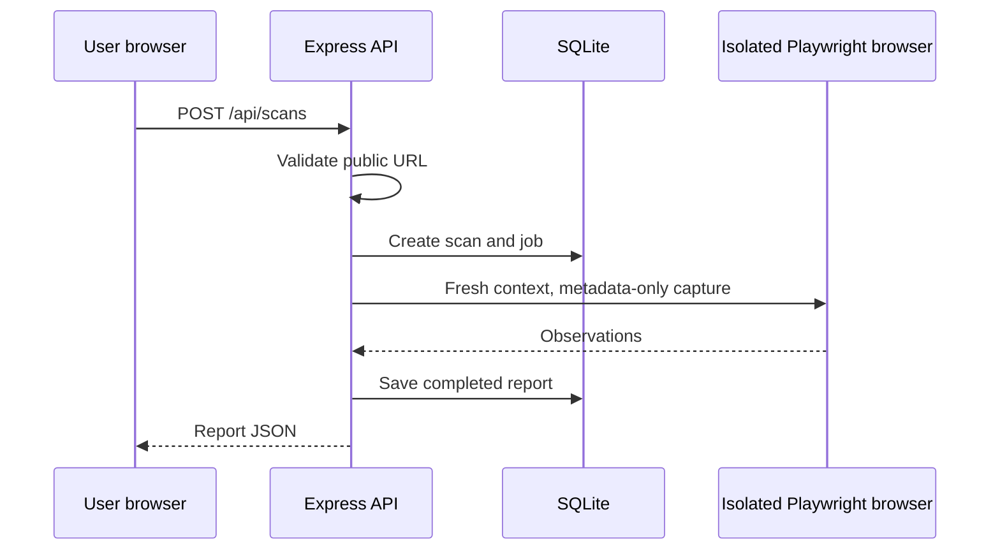
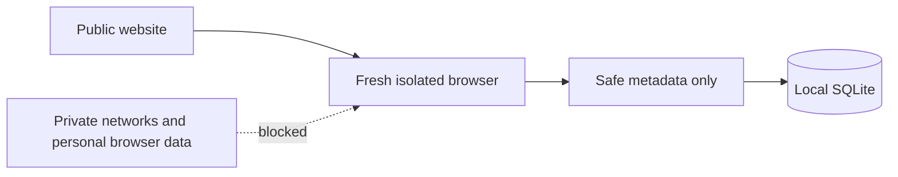

# Actual local architecture diagrams

## Scan sequence

```mermaid
sequenceDiagram
  participant U as User browser
  participant A as Express API
  participant D as SQLite
  participant B as Isolated Playwright browser
  U->>A: POST /api/scans
  A->>A: Validate public URL
  A->>D: Create scan and job
  A->>B: Fresh context, metadata-only capture
  B-->>A: Observations
  A->>D: Save completed report
  A-->>U: Report JSON
```

## Security boundary

```mermaid
flowchart LR
  Public[Public website] --> Browser[Fresh isolated browser]
  Browser --> Metadata[Safe metadata only]
  Metadata --> DB[(Local SQLite)]
  Private[Private networks and personal browser data] -. blocked .-> Browser
```
